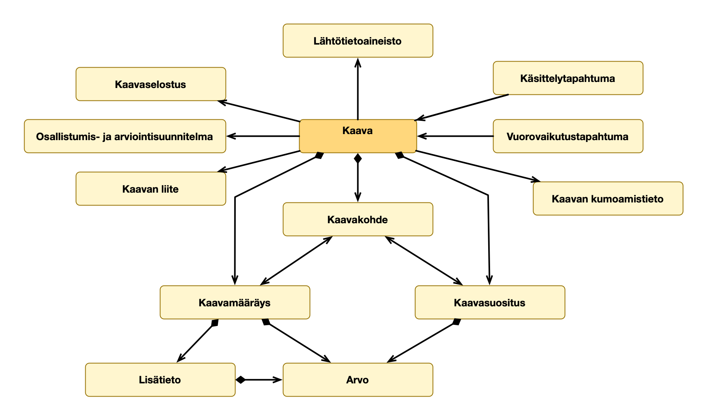

# Käsitteet ja määritelmät
{:.no_toc}

1. 
{:toc}

## Käsitekaavio

(Lataa [käsitekaavio määritelmien kanssa](kaavan-kasitemalli-maaritelmat.png))

## Käsitteet
### Kaava


Viittaukset toisiin käsitteisiin:
* [Lähtötietoaineisto](#lähtötietoaineisto) [0..*]: kaavan laadinnassa hyödynnetty lähtötietoaineisto
* [Kaavaselostus](#kaavaselostus) [0..1]: kaavan kaavaselostus
* [Osallistumis- ja arviointisuunnitelma](#osallistumis--ja-arviointisuunnitelma) [0..1]: kaavan osallistumis- ja arviointisuunnitelma
* [Kaavan liite](#kaavan-liite) [0..*]: muu kaavan liite kuin selostus tai osallistumis- ja arviointisuunnitelma
* [Kaavan kumoamistieto](#kaavan-kumoamistieto) [0..1]: minkä kaavan tai sen osat kaava voimaantullessaan kumoaa
* [Kaavakohde](#kaavakohde) [0..*] (kompositio): kaavan liittyä kaavamääräyksiä tai -suosituksia kohdistava paikkatietokohde
* [Kaavamääräys](#kaavamääräys) [0..*] (kompositio): yleismääräys, joka koskee koko kaavan aluetta
* [Kaavasuositus](#kaavasuositus) [0..*] (kompositio): yleissuositus, joka koskee koko kaavan aluetta

### Lähtötietoaineisto
{% include common/defintionref.html dict="rytj-kaava" id="concept-13" name="kaavan lähtötietoaineisto" def="kaavan laadinnassa hyödynnetty tietoaineisto, joka sisältää sellaista kaavan tulkinnan yhteydessä hyödyllistä tietoa, jota ei luoda ja josta ei päätetä osana kaavoitusprosessia" note="Käytetyt lähtötietoaineistot yhdessä kuvaavat kaavan laadintavaiheessa käytettävissä ollutta taustatietoa, johon tehdyt suunnittelupäätökset ovat perustuneet.
Lähtötietoaineisto voidaan usein esittää graafisesti karttatasona, jossa aineiston sijainnilliset tietokomponentit ja niiden tietosisältö visualisoidaan käytetään standardisoituja merkintätapoja." %}

### Kaavaselostus


### Osallistumis- ja arviointisuunnitelma


### Kaavan liite


### Käsittelytapahtuma


Viittaukset toisiin käsitteisiin:
* [Kaava](#kaava) [1]: kaavan versio, johon tapahtuma liittyy

### Vuorovaikutustapahtuma
{% include common/defintionref.html dict="rytj-kaava" id="concept-1004" name="kaavan vuorovaikutustapahtuma" def="kaavanprosessiin kuuluva tapahtuma, jonka tarkoituksena on tarjota kaavan osallisille tai muille kiinnostuneille mahdollisuus lausua mielipiteensä ja antaa palautetta valmisteilla olevasta kaavasta tai sen osasta" note="Esimerkkejä vuorovaikutustapahtumista ovat kaavaehdotusen nähtävilläolo tai kuulemistilaisuus. Vuorovaikutustapahtumiin voi liittyä dokumentteja, kuten annettuja huomioita ja kysymyksiä, sekä niiden vastineita." %}

Viittaukset toisiin käsitteisiin:
* [Kaava](#kaava) [1]: kaavan versio, johon tapahtuma liittyy

### Kaavan kumoamistieto


### Kaavakohde


Viittaukset toisiin käsitteisiin:
* [Kaava](#kaava) [1]: kaavan versio, johon kohde sisältyy

### Kaavamääräys


Viittaukset toisiin käsitteisiin:
* [Kaava](#kaava) [1]: kaavan versio, johon määräys sisältyy
* [Arvo](#arvo) [0..*]: tarkentava arvo
* [Lisätieto](#lisätieto) [0..*]: tarkentava tai rajaava lisätieto
* [Kaavakohde](#kaavakohde) [0..*]: kaavakohteiden versio, johon määräyksen vaikutus kohdistuu. Jos ei ole, on kyseessä yleismääräys

### Kaavasuositus


Viittaukset toisiin käsitteisiin:
* [Kaava](#kaava) [1]: kaavan versio, johon suositus sisältyy
* [Arvo](#arvo) [0..*]: tarkentava arvo
* [Kaavakohde](#kaavakohde) [0..*]: kaavakohteiden versio, johon suosituksen vaikutus kohdistuu. Jos ei ole, on kyseessä yleissuositus

### Lisätieto


Viittaukset toisiin käsitteisiin:
* [Arvo](#arvo) [0..*]: tarkentava arvo

### Arvo


### Kaavatietovarasto


